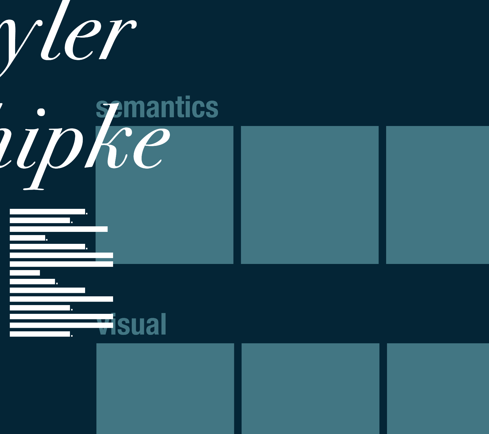

# Portfolio

This is a project designed to show the different code and projects that I have worked on within my career.  I have felt the need to showcase my talent and hope that my message is clear.  Below I will discuss the various coding techniques and planning strategies to get this portfolio off the ground.

##### WIREFRAME

Prior to coding, a wireframe was made.  This shows the UX ideas that we want  in its most conceptual form.  The actual product will look very similar but include concepts that increase usability, at the cost of aesthetics.  This is similar to that of concepts cars; the final product must include features that the concept never intendee to include.

Note there are unmistakable similarities between the concept and the final product.  The wireframe is made by layering different aspects of the product in Adobe Photoshop, similar to how z-indexes are rendered by the DOM.

##### CODE PLANNING

Once the wireframe was complete, an overal plan was brainstormed.  What languages and libraries should be included?  How important is this selection?  I ended up choosing time over library selection.  I needed to get this up and running as quickly as possible, so I decided on Bootstrap as my main library.  This concept included lots of horizontal scrolling cards, something that is not widely implemented.  As such, I knew that most of my time would be focused on getting the card dynamics as smooth as possible.   In the future, a React.js port is a priority.  React.js and Vue are the future of rendering, with their SPA architectures and virtual DOM.  However, at the moment, learning concepts of React.js would eat into the general coding, and as such, I have settled for a more traditional CSS library.

##### OUTLINING

Here I have an outline for my code structure.  In the future, the articles in my Portfolio will be stored on an external database. At the moment, they are pulled from the server's JavaScript files.  My priority is Front-End, but I would like to eventually showcase my Back-End skills for a more well-rounded career.

